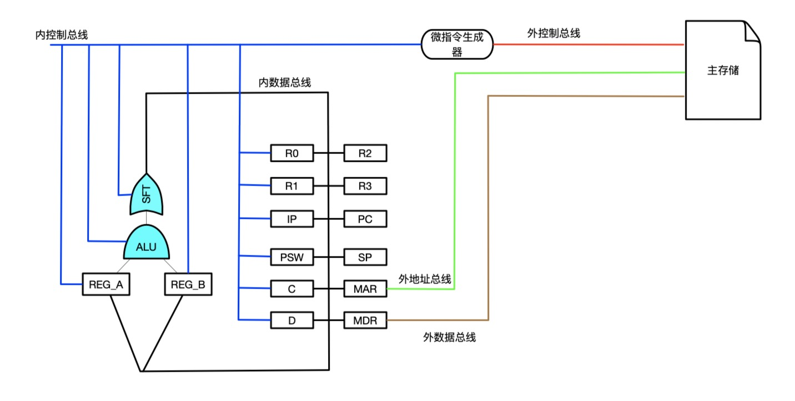

# Virtual Computer

[](https://github.com/hexueyuan/virtualComputer/blob/v0.01/LICENSE)

---
一个从底层硬件模拟的简单计算机。从设计总线、寄存器、ALU、移位器、存储器到设计指令集、微指令控制器，实现了常用的十四条汇编指令，原型机的逻辑结构采用内外总线型，非常容易借此理解计算机组成原理。



# 功能预览
* **指令集**  

指令         |说明             
-------------|--------------  
MOV|支持寄存器（值、内存地址）到寄存器（内存地址）  
ADD|算数加法  
AND|逻辑与  
OR|逻辑或  
NOT|逻辑非  
XOR|逻辑异或  
ZERO|判断参数是否为0，设置PSW寄存器  
CMP|比较两个参数，设置PSW寄存器  
JMP|无条件跳转，后接内存地址  
JMPZ|当PSW寄存器设置了ZERO位时跳转  
JMPN|当PSW寄存器设置了NAGITIVE位时跳转  
JMPP|当PSW寄存器设置了POSITIVE位时跳转  
LSFT|逻辑左移  
RSFT|逻辑右移  
NOP|空指令  

* **指令执行逻辑**  
初始化时PC寄存器值为0，此时从Memory内存的地址0处取得第一条指令，执行指令流程如下：  
1. 从PC寄存器存的内存地址处取得下一条指令，并放到IP寄存器中，然后PC自增1指向下一条地址。  
2. 微指令生成器从IP寄存器中取得指令，并生成相应的微指令，这里微指令生成器更像是采用逻辑电路生成而不是微程序。 
3. 将操作数1传到选择器A中，零操作数指令忽略该过程。  
4. 将操作数2传到选择器B中，零操作数和单操作数指令忽略该过程。  
5. 计算PSW的值，并传递到PSW寄存器。  
6. 计算指令的结果并传送到暂存器C。  

* **极易扩展成任何类型的机器**  
在src/kernel/base目录下边我详细构建了bus、register、mutil_register、selector、shiftor等类，同时在上层目录还有cpu、memory等类，在options.h中定义数据宽度、指令宽度、指令位说明等，因此可以通过简单等配置重构建实现任意种类型和结构的简单机器，在后文的细节部分会详细讨论这些内容。

* **交互式运行**  
类似于调试过程的交互式运行，可以单步执行指令。通过控制指令可以调试输出寄存器参数、CPU参数、内存地址值等。  

* **提供简单的编译程序**  
asm工具将汇编指令转换成二进制机器码，以便于加载到内存中运行。源文件在tool/asm.cpp中，执行./asm code.src code.des汇编code.src文件中的汇编指令到code.des中。  

* **交互式终端指令说明**  
执行bin/computer可执行文件之后，进入VirtualComputer的交互式终端，之后可以在这个终端下加载编译后的二进制机器码到内存中，可以单步执行指令，可以调试输出信息等，简单演示如下：  
  
交互终端支持指令如下：  

指令|参数|说明  
---|---|---  
load|file-path|加载二进制机器码，使用tool下的asm工具汇编出来  
debug|options|调试指令，options可以是单个寄存器名，也可以是Register输出全部寄存器，也可以是CPU信息  
exit|退出  

# 下载&编译  
执行
```
git clone git@github.com:hexueyuan/virtualComputer.git
cd VirtualComputer
mkdir bin
cd src & ./compile.sh
cd ../tool & ./compile.sh
```  
在bin目录下生成asm汇编工具和computer交互式终端程序。  
# 待完成  

- [ ] 微指令生成器部分细节未按照实际物理结构实现
- [ ] 单元测试
- [ ] 更丰富的指令集和更接近使用的汇编工具
- [ ] 考虑如何更接近实现模拟的时钟信号控制指令执行  

# 一些细节
TODO

# 参与开发
非常欢迎有兴趣的朋友可以一起来完善这个项目，我的预期是在这个基础之上完成一个前端的游戏，类似于Appstore上的Human Resource Machine。我一个人开发进度应该不会很快，所以非常欢迎有人加入一起开发！

# 协议
MIT
